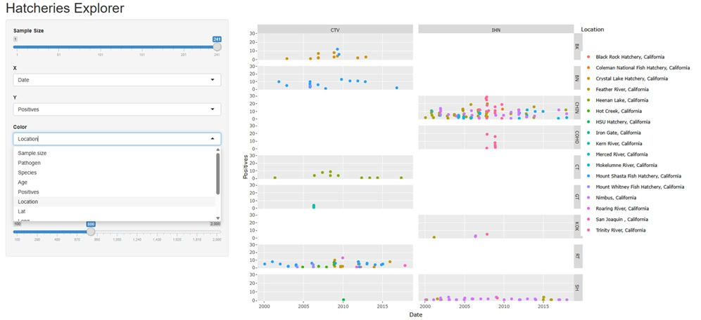
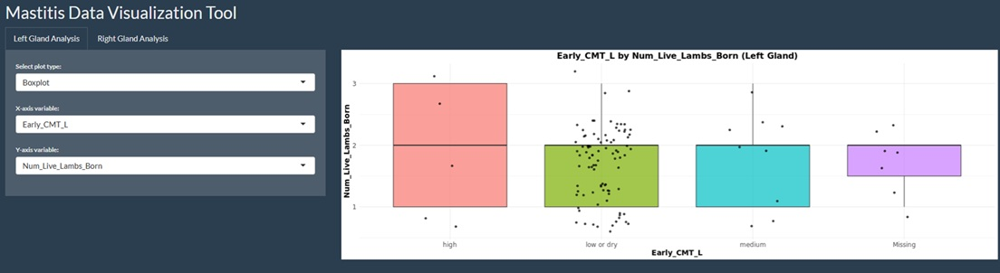
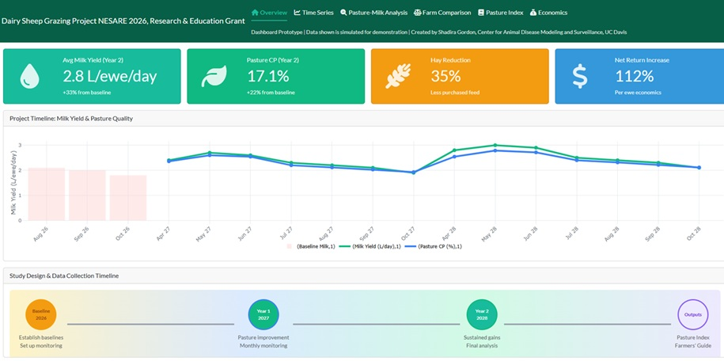

## Interactive Dashboards

I design and deploy R Shiny dashboards for disease surveillance, livestock health monitoring, and epidemiological data analysis. These tools are actively used by researchers, government agencies, and livestock producers.

Click **Launch Dashboard** to launch any app below for the full experience.

---

### Salmonid Disease Surveillance Dashboard

An interactive surveillance platform developed in collaboration with the California Department of Fish and Wildlife (CDFW) and CADMS. This dashboard visualizes spatiotemporal patterns of fish pathogen distribution across California hatcheries, integrating environmental DNA (eDNA) detection data with climatic variables to support early warning and decision-making for aquatic animal health.

**Built with:** R Shiny, leaflet, ggplot2, plotly

**Collaborators:** CDFW, Dr. Beatriz Martínez-López

{target="_blank"}

[Launch Full Dashboard](https://cadms-epiteam.shinyapps.io/fish/){.btn .btn-primary target="_blank"}

---

### Subclinical Mastitis in Dairy Sheep Dashboard

A longitudinal data exploration tool for analyzing subclinical mastitis patterns in dairy sheep at the Hopland Research and Extension Center. The dashboard presents California Mastitis Test (CMT) results, bacteriological culture data, pathogen distributions, and risk factor analyses including parity, lactation stage, and OPP serostatus across multiple sampling periods.

**Built with:** R Shiny, ggplot2, DT, plotly

**Collaborators:** Hopland Research and Extension Center, Dr. Beatriz Martínez-López

{target="_blank"}

[Launch Full Dashboard](https://8squvn-shadira-gordon.shinyapps.io/Mastitis_project/){.btn .btn-primary target="_blank"}

---

### NESARE Dairy Sheep Discussion Group Dashboard

A flock health and production monitoring platform built for dairy sheep producer discussion groups funded by NESARE. The dashboard tracks ewe milk production, lambing records, and flock health indicators across six farm groups, enabling producers to benchmark performance and identify management opportunities.

**Built with:** R Shiny, readxl, ggplot2, DT

**Collaborators:** NESARE, dairy sheep producers

{target="_blank"}

[Launch Full Dashboard](https://8squvn-shadira-gordon.shinyapps.io/NESARE/){.btn .btn-primary target="_blank"}

---

## Research Interests

My research sits at the intersection of veterinary medicine, epidemiology, and public health, guided by a One Health framework. Current and ongoing areas include:

::: {.content-box}
- **Antimicrobial resistance surveillance** in livestock production systems
- **Small ruminant disease ecology**, particularly subclinical mastitis in dairy and meat sheep
- **Aquatic animal health**, including spatiotemporal modeling of salmonid pathogen distribution
- **Infectious disease modeling** using compartmental models (SIR/SEIR), GLMMs, and machine learning
- **Digital surveillance tools** for real-time disease monitoring and risk communication
:::